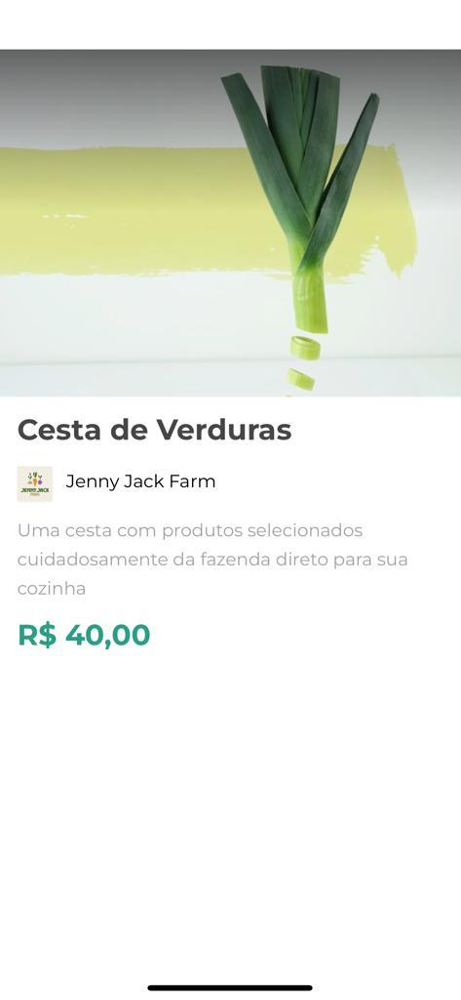

# Orgs Cesta - ReactNative (mini project) 


## 📁 Acesso ao projeto
**Para executar esse projeto é necessário instalar algumas dependências. Siga: [Instalação Expo](https://docs.expo.dev/get-started/installation/)**

## 🛠️ Abrir e rodar o projeto
```bash
  #clonar o repositorio
  $ git clone https://github.com/felipe199903/orgs-cesta.git

  #entrar na pasta do projeto
  $ cd orgs-cesta

  #instalar as dependencias
  $ yarn

  #Ultilize o QR code ou umas das outras alternativas.
  $ expo start


```

## Stack de aprendizado
   

## License

MIT

**Use para fins de aprendizado e prática**
